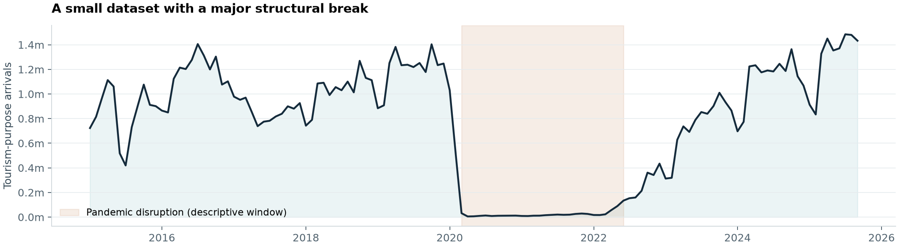
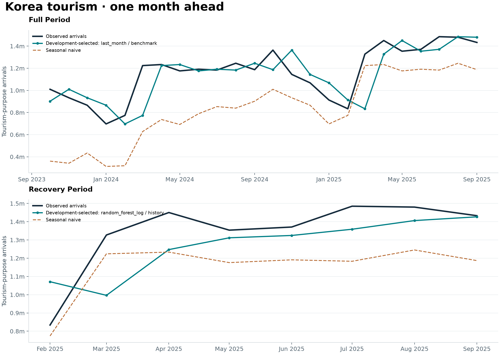

# Korea Tourism Forecasting

[](https://github.com/davemaxuell/korea-tourism-forecasting/actions/workflows/ci.yml)

[](LICENSE)

**Do K-culture search interest and exchange rates improve next-month tourism forecasts beyond recent visitor history?**

A reproducible study of **129 monthly observations, January 2015–September 2025**, predicting foreign arrivals to Korea for tourism purposes. The project compares simple benchmarks with three regressors, tests the incremental value of external signals, and exposes every forecast for inspection.



## Read the evidence

Start with the [generated results report](reports/model_results.md): candidates selected on development data, final holdout scores, and a feature-ablation table. The [monthly predictions](reports/predictions.csv) and [metrics](reports/metrics.csv) make the conclusions auditable.



The plots show candidates selected **before** the final holdout. All candidates are reported, including last-month and seasonal-naive benchmarks. Added complexity has to earn its place; the experiment does not assume that K-culture signals will help.

| Scenario | Development-selected candidate | Final holdout WAPE | Seasonal-naive WAPE |
| --- | --- | ---: | ---: |
| Full period | Last month | 9.88% | 28.68% |
| Recovery period | Random forest · visitor history | 9.93% | 14.16% |

External signals did not improve the random forest in either holdout. The full-period history-only forest scored 6.76% WAPE, but it was **not** the development-selected candidate. This distinction separates an observed result from an honest selection procedure.

## What makes the experiment reviewable

| Decision | Implementation |
| --- | --- |
| Predict one month ahead | Each forecast uses earlier observations; models refit at every monthly origin. |
| Separate selection from assessment | Development dates precede the final holdout. Candidate selection uses development WAPE only. |
| Test the research question directly | Matched feature sets: history, history + FX, history + interest, and all signals. |
| Keep strong simple benchmarks | Last month and the same month last year compete with every learned model. |
| Guard the time axis | Duplicate months, gaps, invalid values, and misaligned lags raise errors. |
| Make results reproducible | Locked dependencies, fixed seed, generated reports, and SHA-256 input/code/artifact manifests. |

This is **retrospective forecasting research**. It assumes previous-month observations are available at each origin. Publication delays, revised data, and historical Google Trends vintages are not available in the source files, so the results do not establish deployable real-time accuracy. The pandemic creates a large structural break; the recovery scenario is particularly small. See [methodology and limitations](docs/METHODOLOGY.md).

## Reproduce

Python 3.12 is the reference environment; 3.11–3.13 are supported. Run from the repository root. The default workflow is offline after dependency installation and requires no API key.

Using [uv](https://docs.astral.sh/uv/), with the checked-in lockfile:

```bash
uv sync --frozen --extra dev
uv run --frozen korea-tourism reproduce
uv run --frozen pytest
```

Or install with standard Python tooling (resolves compatible versions rather than the exact lock):

```bash
python -m venv .venv
# macOS / Linux
source .venv/bin/activate
# Windows PowerShell: .\.venv\Scripts\Activate.ps1
python -m pip install -e ".[dev]"
python -m korea_tourism reproduce
python -m pytest
```

The experiment fits 12 model/feature combinations at 72 monthly origins, plus two benchmarks. Allow a few minutes depending on hardware. Regeneration replaces the processed data and report artifacts in this checkout.

Individual stages:

```bash
korea-tourism build
korea-tourism evaluate --seed 42
```

Use `--root PATH` on either command to target another data workspace. The original `python src/build_dataset.py` and `python src/train_baseline.py` entry points remain available after installation.

## Experiment design

| Scenario | Eligible training history | Development forecasts | Final holdout |
| --- | --- | --- | --- |
| Full period | Jan 2016 onward, after 12 lag months | Jan 2021–Sep 2023 · 33 months | Oct 2023–Sep 2025 · 24 months |
| Recovery period | Jul 2022 onward | Jul 2024–Jan 2025 · 7 months | Feb–Sep 2025 · 8 months |

Models: ridge regression, random forest, and histogram gradient boosting, all with `log1p` targets and fixed hyperparameters. Ridge scaling is fitted inside each training window. Features use 1-, 2-, 3-, and 12-month lags plus sine/cosine month seasonality. The retrospective COVID-period flag is excluded from forecasting inputs.

WAPE is the selection metric; MAE, RMSE, signed bias, and skill against seasonal naive provide complementary views. Errors are pooled across monthly predictions. No random train/test split, holdout tuning, or causal interpretation is used.

## Repository map

```text
src/korea_tourism/
  data.py           Raw parsing, monthly joins, calendar features, lags
  validation.py     Shared data contracts
  models.py         Fixed estimators and explicit feature groups
  evaluation.py     Monthly backtests, candidate selection, metrics
  reporting.py      Generated report, figures, provenance manifest
  fetch.py          Optional ECOS download to a staging directory
tests/              Unit, regression, integration, and artifact checks
data/raw/           Preserved research inputs
data/processed/     Rebuildable, committed monthly tables
reports/            Generated evidence: predictions, metrics, figures, manifest
docs/               Methods, source caveats, and maintenance notes
uv.lock             Resolved dependency versions and package hashes
```

## Data and provenance

The inputs comprise tourism-purpose visitor spreadsheets, Google Trends exports and keyword tables, and KRW-denominated exchange-rate tables. See the [data dictionary](data/README.md) and [source inventory](docs/DATA_SOURCES.md) for units, transformations, and missing provenance. Google Trends values are normalized interest indices, not search counts. Source attribution inherited from the original project is distinguished from independently verified provenance.

The optional ECOS downloader is separate from reproduction. Set `ECOS_API_KEY` in the environment, then run `korea-tourism fetch --start 201501 --end 202509`. It writes to ignored `data/external/` for review; it does not replace the bundled inputs. `.env.example` is a template, and `.env` is not automatically loaded.

## Development

```bash
uv run --frozen ruff check src tests
uv run --frozen ruff format --check src tests
uv run --frozen pytest --cov=korea_tourism --cov-report=term-missing
```

CI checks supported Python versions, rebuilds data from raw inputs, tests temporal isolation and report generation, and runs the full reference experiment. See [contributing](CONTRIBUTING.md) for the artifact update workflow.

Code is [MIT licensed](LICENSE). Third-party datasets retain their providers' applicable terms; the code license does not grant data redistribution rights. Citation metadata is in [CITATION.cff](CITATION.cff).
